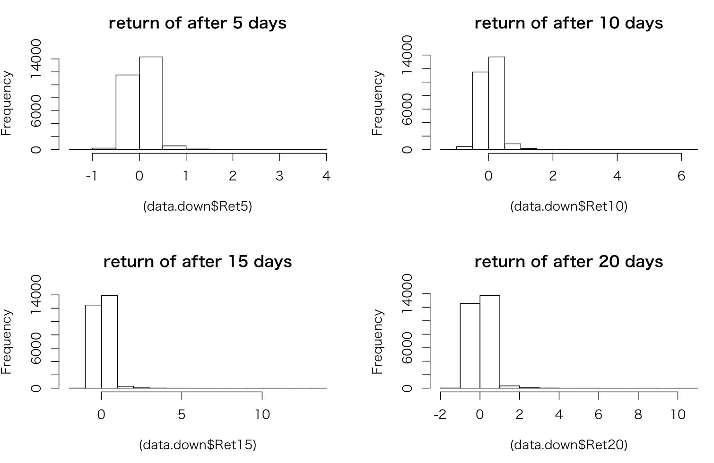
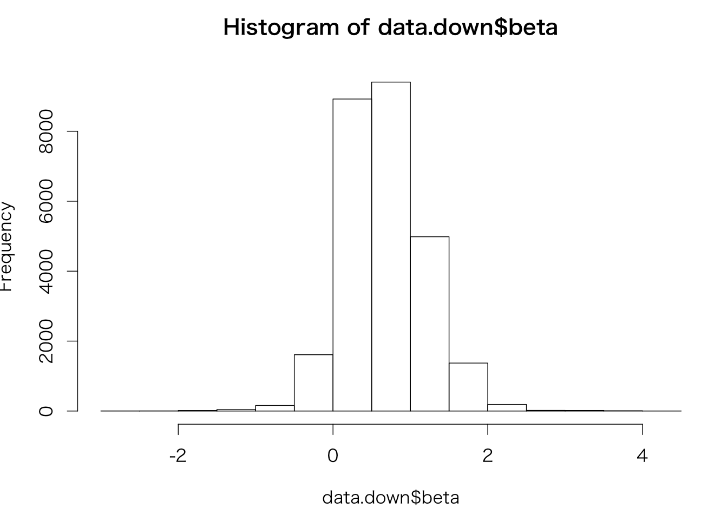

# ドローダウンからの復活
短期的に大きく下がった場合には戻すはず

[ソースコード](../down/)

----

## データ    
#### 銘柄    
TOPIX銘柄    
#### 期間    
使用データ：日足データ ST_priceHistAdj    
学習用    ：2000/01/01-2010/12/31    
テスト用    ：2011/01/01-2015/12/31    

## 定義する    
まずはどれくらい急激に下がるかを確認      
過去5日間で20%以上のマイナス    
100円以下の銘柄削除    

----

## 検証１
普通に
```
ruby down_data.rb
R --vanilla < down.R
```
件数    ：43891    
#### ダウン後の上昇
```
R --vanilla < down_data.R
```
２０％ダウン後から、５日、１０日、１５日、２０日後のリターンを分布で調べる    
対TOPIXのベータ調整済み

```
> hist((data.down$Ret5),main="return of after 5 days")
> summary(data.down$Ret5)
    Min.  1st Qu.   Median     Mean  3rd Qu.     Max.
-1.03200 -0.06339  0.01528  0.03554  0.11420  3.57500
>
> hist((data.down$Ret10),main="return of after 10 days")
> summary(data.down$Ret10)
    Min.  1st Qu.   Median     Mean  3rd Qu.     Max.
-1.06900 -0.08177  0.01699  0.04470  0.14260  6.27800
>
> hist((data.down$Ret15),main="return of after 15 days")
> summary(data.down$Ret15)
    Min.  1st Qu.   Median     Mean  3rd Qu.     Max.
-1.04300 -0.10420  0.01310  0.04388  0.15630 13.41000
>
> hist((data.down$Ret20),main="return of after 20 days")
> summary(data.down$Ret20)
    Min.  1st Qu.   Median     Mean  3rd Qu.     Max.
-1.11200 -0.12260  0.01380  0.04748  0.17130 10.73000
```

#### 上昇後の下落
比較用にまったく逆のものをやってみた。     
```
R --vanilla < up_data.R
```
２０％アップ後から、５日、１０日、１５日、２０日後のリターンを分布で調べる    
対TOPIXのベータ調整済み

```
> hist((data.up$Ret5),main="return of after 5 days")
> summary(data.up$Ret5)
     Min.   1st Qu.    Median      Mean   3rd Qu.      Max.
-1.056000 -0.098560 -0.028460 -0.006149  0.044670  3.441000
> hist((data.up$Ret10),main="return of after 10 days")
> summary(data.up$Ret10)
     Min.   1st Qu.    Median      Mean   3rd Qu.      Max.
-1.059000 -0.121400 -0.036260 -0.003398  0.058930  9.557000
>
> hist((data.up$Ret15),main="return of after 15 days")
> summary(data.up$Ret15)
     Min.   1st Qu.    Median      Mean   3rd Qu.      Max.
-1.055000 -0.138300 -0.040580 -0.000235  0.074480  5.589000
>
> hist((data.up$Ret20),main="return of after 20 days")
> summary(data.up$Ret20)
     Min.   1st Qu.    Median      Mean   3rd Qu.      Max.
-1.049000 -0.157100 -0.046690 -0.000485  0.085480  9.707000
>
```

#### 結果
見事に２０％ダウン後には５日、１０日、１５日、２０日後のリターンはプラス     
２０％アップ後には５日、１０日、１５日、２０日後のリターンはダウン

----

## 検証２
ベータ別に分けてみる
#### ベータの分布
```
> hist(data.down$beta)
> summary(data.down$beta)
   Min. 1st Qu.  Median    Mean 3rd Qu.    Max.
-2.8410  0.3032  0.6210  0.6655  0.9941  4.1000
```


#### down
```
> # とりあえずbeta<0
> data.down.1<-subset(data.down,beta<0)
> summary(data.down.1$Ret5)
     Min.   1st Qu.    Median      Mean   3rd Qu.      Max.
-0.874000 -0.046890  0.008363  0.061560  0.135200  2.162000
> summary(data.down.1$Ret10)
    Min.  1st Qu.   Median     Mean  3rd Qu.     Max.
-0.90830 -0.07228  0.01646  0.06681  0.16270  4.38200
> summary(data.down.1$Ret15)
    Min.  1st Qu.   Median     Mean  3rd Qu.     Max.
-0.97830 -0.10070  0.01075  0.06886  0.16880  5.22800
> summary(data.down.1$Ret20)
    Min.  1st Qu.   Median     Mean  3rd Qu.     Max.
-0.98510 -0.11500  0.01334  0.08307  0.18080 10.67000
>
> # beta>=0 and beta<1
> data.down.2<-subset(data.down,beta>=0 && beta<1)
> summary(data.down.2$Ret5)
    Min.  1st Qu.   Median     Mean  3rd Qu.     Max.
-1.03200 -0.06339  0.01528  0.03554  0.11420  3.57500
> summary(data.down.2$Ret10)
    Min.  1st Qu.   Median     Mean  3rd Qu.     Max.
-1.06900 -0.08177  0.01699  0.04470  0.14260  6.27800
> summary(data.down.2$Ret15)
    Min.  1st Qu.   Median     Mean  3rd Qu.     Max.
-1.04300 -0.10420  0.01310  0.04388  0.15630 13.41000
> summary(data.down.2$Ret20)
    Min.  1st Qu.   Median     Mean  3rd Qu.     Max.
-1.11200 -0.12260  0.01380  0.04748  0.17130 10.73000
>
> # beta>=1
> data.down.3<-subset(data.down,beta>=1)
> summary(data.down.3$Ret5)
    Min.  1st Qu.   Median     Mean  3rd Qu.     Max.
-1.03200 -0.06131  0.01995  0.03932  0.11490  2.18900
> summary(data.down.3$Ret10)
    Min.  1st Qu.   Median     Mean  3rd Qu.     Max.
-1.06900 -0.08180  0.01886  0.04674  0.14590  2.59400
> summary(data.down.3$Ret15)
    Min.  1st Qu.   Median     Mean  3rd Qu.     Max.
-1.04300 -0.10740  0.01448  0.04734  0.16740  4.29800
> summary(data.down.3$Ret20)
    Min.  1st Qu.   Median     Mean  3rd Qu.     Max.
-1.11200 -0.12820  0.01680  0.04793  0.18030  3.25000
```
#### up
```
# とりあえずbeta<0
> data.up.1<-subset(data.up,beta<0)
> summary(data.up.1$Ret5)
   Min.  1st Qu.   Median     Mean  3rd Qu.     Max.
-0.57780 -0.12730 -0.02968 -0.03539  0.01658  1.68600
> summary(data.up.1$Ret10)
   Min.  1st Qu.   Median     Mean  3rd Qu.     Max.
-0.97490 -0.15730 -0.04539 -0.04233  0.02419  2.22400
> summary(data.up.1$Ret15)
   Min.  1st Qu.   Median     Mean  3rd Qu.     Max.
-0.98040 -0.17640 -0.05979 -0.04520  0.03739  5.58900
> summary(data.up.1$Ret20)
   Min.  1st Qu.   Median     Mean  3rd Qu.     Max.
-0.98110 -0.19660 -0.06784 -0.04812  0.04128  9.70700
>
> # beta>=0 and beta<1
> data.up.2<-subset(data.up,beta>=0 && beta<1)
> summary(data.up.2$Ret5)
    Min.   1st Qu.    Median      Mean   3rd Qu.      Max.
-1.056000 -0.098560 -0.028460 -0.006149  0.044670  3.441000
> summary(data.up.2$Ret10)
    Min.   1st Qu.    Median      Mean   3rd Qu.      Max.
-1.059000 -0.121400 -0.036260 -0.003398  0.058930  9.557000
> summary(data.up.2$Ret15)
    Min.   1st Qu.    Median      Mean   3rd Qu.      Max.
-1.055000 -0.138300 -0.040580 -0.000235  0.074480  5.589000
> summary(data.up.2$Ret20)
    Min.   1st Qu.    Median      Mean   3rd Qu.      Max.
-1.049000 -0.157100 -0.046690 -0.000485  0.085480  9.707000
>
> # beta>=1
> data.up.3<-subset(data.up,beta>=1)
> summary(data.up.3$Ret5)
    Min.   1st Qu.    Median      Mean   3rd Qu.      Max.
-0.708800 -0.091730 -0.027740 -0.003369  0.047750  1.739000
> summary(data.up.3$Ret10)
    Min.   1st Qu.    Median      Mean   3rd Qu.      Max.
-0.934300 -0.111800 -0.032450  0.001798  0.066620  3.279000
> summary(data.up.3$Ret15)
    Min.   1st Qu.    Median      Mean   3rd Qu.      Max.
-0.916000 -0.133300 -0.039400  0.005308  0.079450  3.785000
> summary(data.up.3$Ret20)
    Min.   1st Qu.    Median      Mean   3rd Qu.      Max.
-0.890100 -0.157200 -0.049080  0.000322  0.087360  4.758000
```
#### 結果
Betaを,beta<0,0<=beta<1,beta>=1の３クラスに分けてそれぞれ分布確認したが、あまり変わらない
