# エリオット波動検証

ZIGZAGモデルで作成したエリオット波動のフィボナッチ級数検証

[検証](http://www.geocities.jp/site_click/elliot.html)

## 条件
zigzag　パラメタを0.01

----

## 第２波
第１波動の0.382、0.5、0.618押しが基本であり、第１波動の大部分を戻すこともあります。    
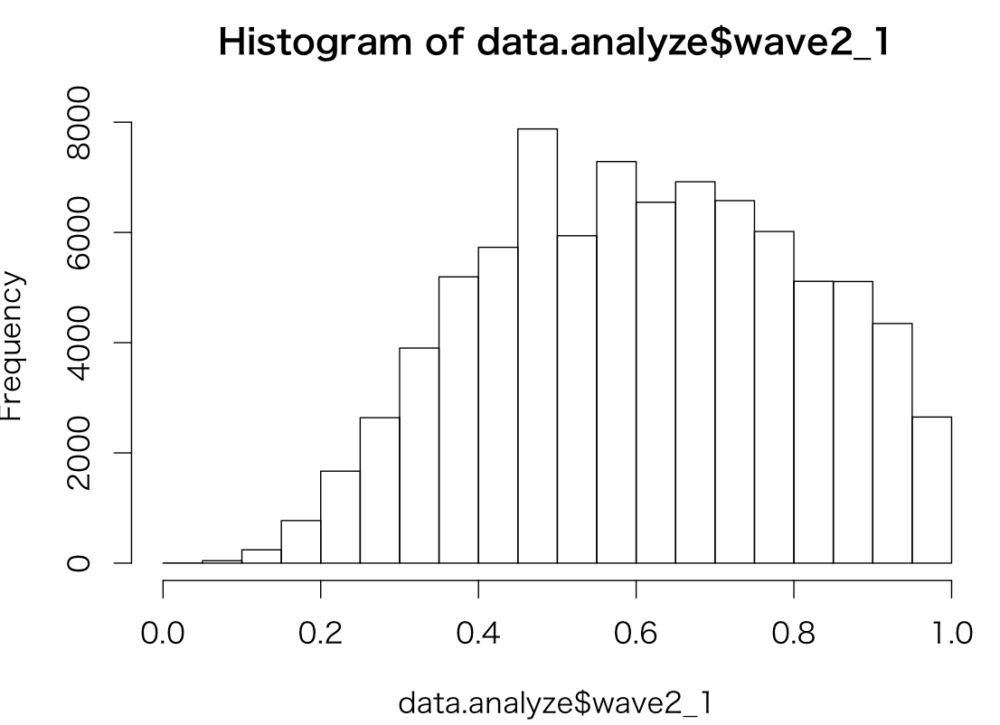

----

## 第３波
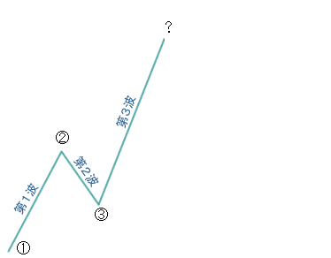    

第１波動の1.618倍、2.618倍、3倍    
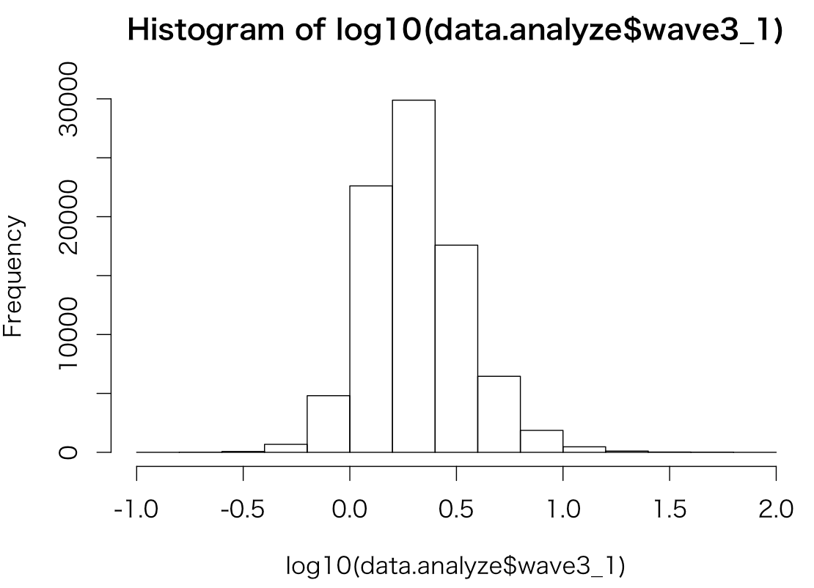

----

## 第４波
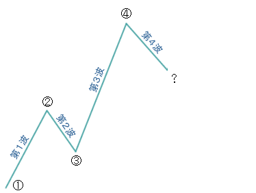    

第１波動の全値か1.618倍。あるいは第３波動の0.382、0.5、0.618倍を戻します      
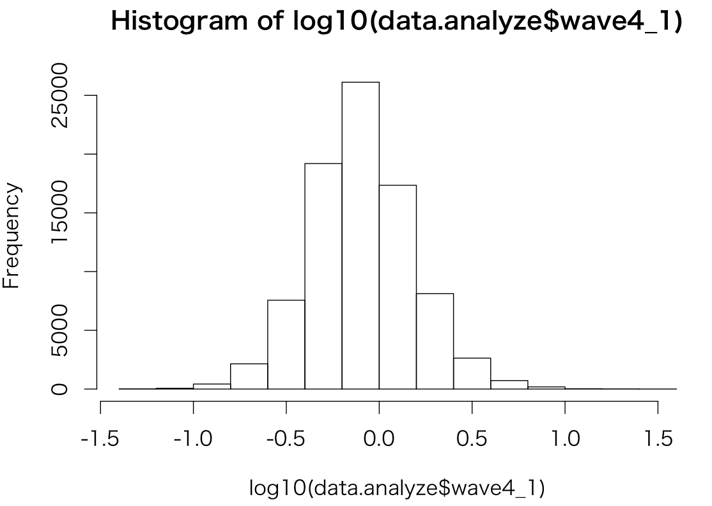    

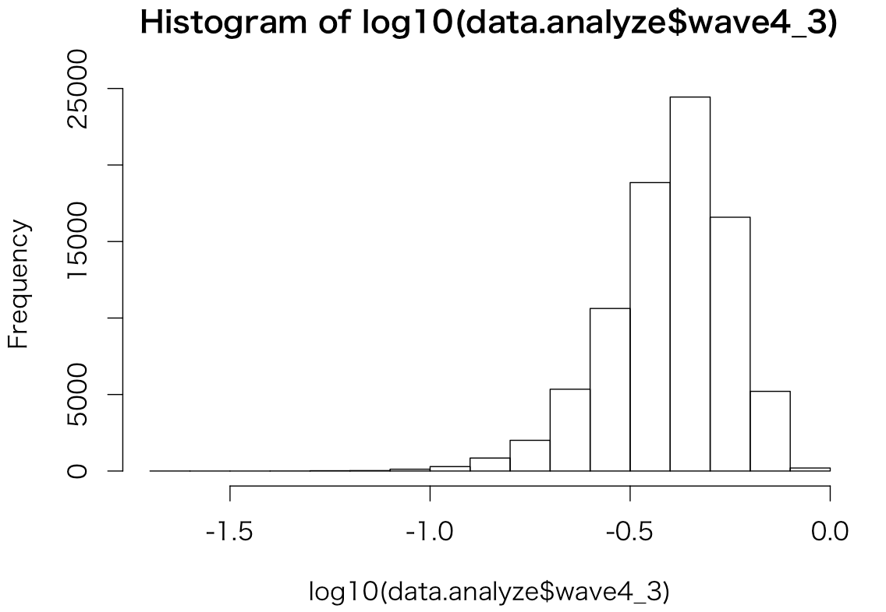    

----

## 第５波
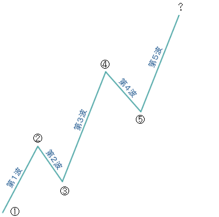    

第１波動の0.382、0.5、0.618、1倍、または、第4波の下落幅の1.618倍の上昇となります    

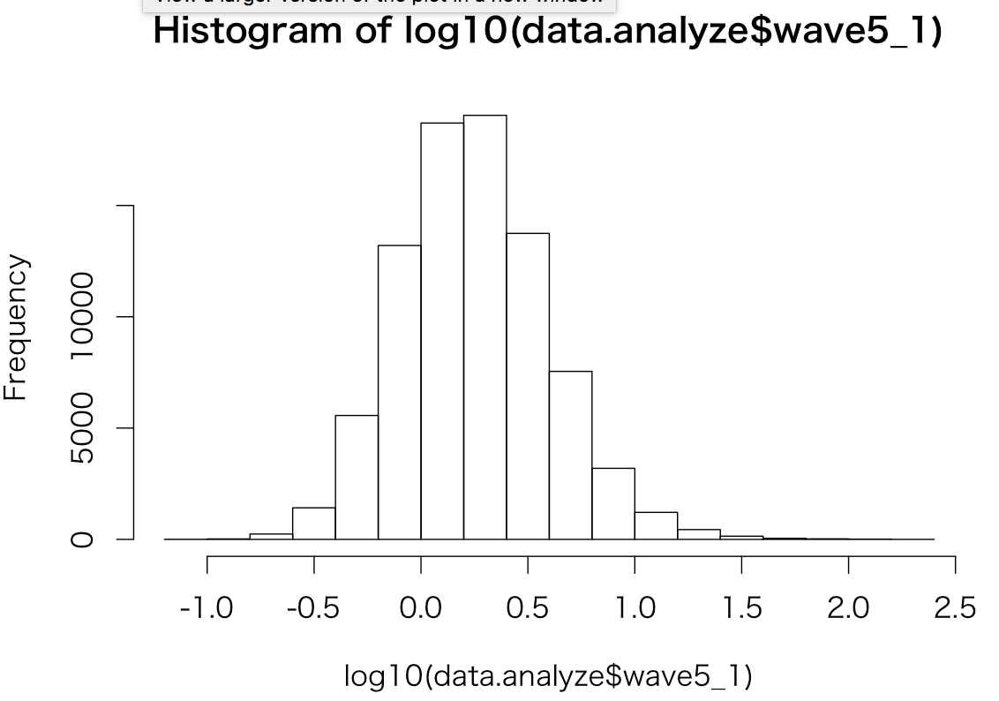    

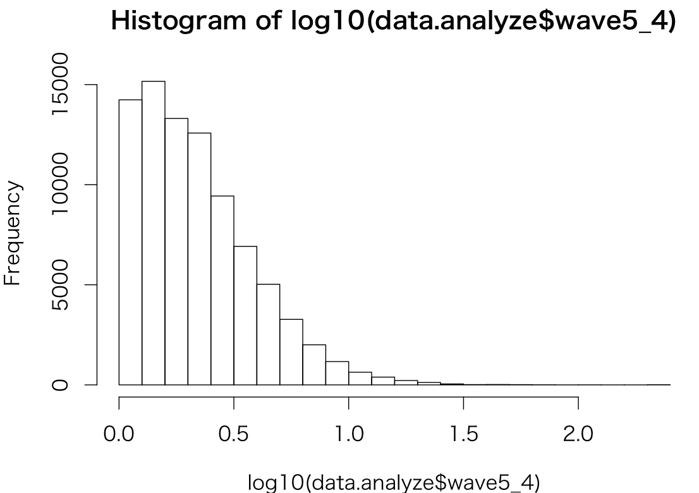    

----

## 第A波
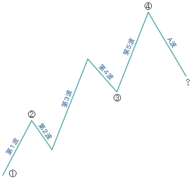    

第５波動の0.382、0.5、0.618押し、あるいは第１波動0.382、0.5、0.618、1倍を下落します。    

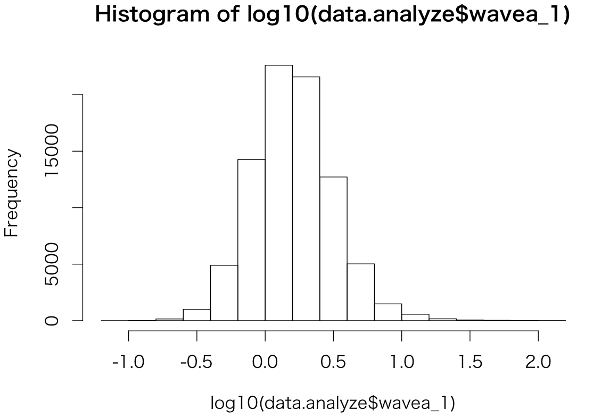    

----

## 第B波

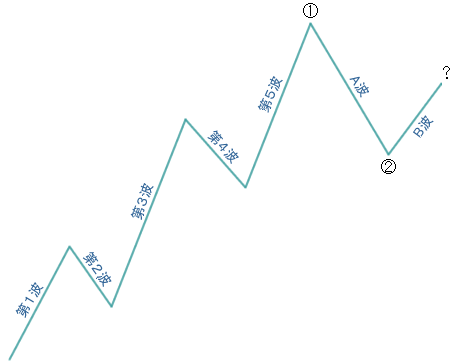

a波動の0.382、0.5、0.618を戻します。    

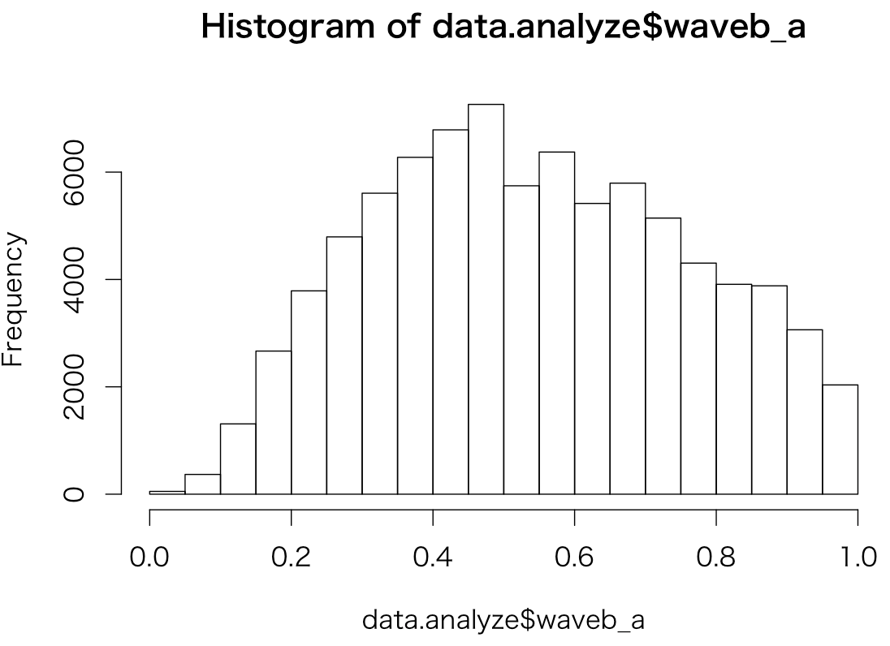

----

## 第C波
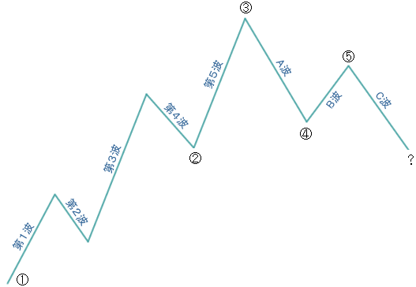     

a波動の0.382、0.5、0.618、1倍か1.618倍を下落します。      

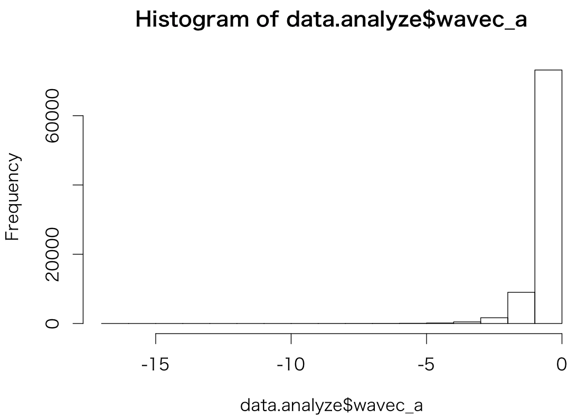

----

## まとめ

どうみてもフィボナッチの法則は満たされていない。。。。
