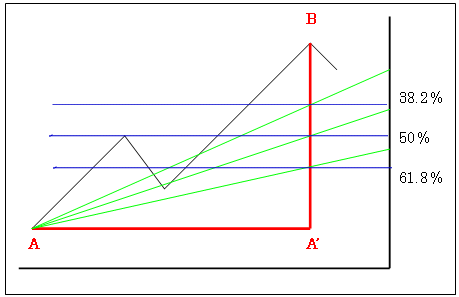

# フィボナッチファン

## データ期間
2000-01-01 - 2010-12-31

## パラメタ
- zigzag 上限下限パラメタ   

## シミュレーション
戻りの当たり具合を見る
- 38.2%
- 50%
- 61.8%

## 実行
[ソース](https://github.kabumap.tokyo/utsubo/chartPatternBatch/tree/master/elliott)
```
python fibofan.py
```
## 結果

zigzagを0.01-0.1まで。大きくなるとピークボトムの感覚が大きくなる     
#### 225銘柄のみ


|zigzagパラメタ|ピークボトムの数|フィボナッチが起きた回数|61%|50%|38%|信頼度|
|---:|---:|---:|---:|---:|---:|---:|
|0.01|117021|117021|24|213|61|0.00254655147367|
|0.02|75835|75835|12|81|31|0.00163512889827|
|0.03|52679|52679|7|44|24|0.00142371723078|
|0.04|39046|39046|1|30|17|0.00122931926446|
|0.05|30100|30100|1|17|11|0.000963455149502|
|0.06|24025|24025|1|11|4|0.000665972944849|
|0.07|19587|19587|1|6|1|0.000408434165518|
|0.08|16415|16415|1|2|1|0.000243679561377|
|0.09|13993|13993|0|3|0|0.000214392910741|


#### 全銘柄

|zigzagパラメタ|フィボナッチが起きた回数|61%|50%|38%|信頼度|
|---:|---:|---:|---:|---:|---:|


## まとめ
