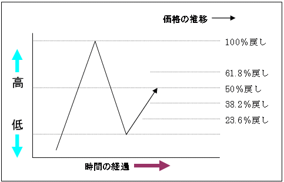

# フィボナッチリトレースメント


## データ期間
2000-01-01 - 2010-12-31

## パラメタ
- zigzag 上限下限パラメタ   

## シミュレーション
戻りの当たり具合を見る
- 38.2%
- 50%
- 61.8%

## 実行
[ソース](https://github.kabumap.tokyo/utsubo/chartPatternBatch/tree/master/elliott)
```
python fiboret.py
```
## 結果

zigzagを0.01-0.1まで。大きくなるとピークボトムの感覚が大きくなる     
#### 225銘柄のみ


|zigzagパラメタ|ピークボトムの数|フィボナッチが起きた回数(4点めが１点めを突き抜ける)|61%|50%|38%|信頼度|
|---:|---:|---:|---:|---:|---:|---:|
|0.01|117021|55586|3929|4224|4145|0.221242758968|
|0.02|75835|36147|2646|2854|2652|0.225523556588|
|0.03|52679|25191|1886|1965|1863|0.226827041404|
|0.04|39046|18737|1370|1479|1386|0.226023376208|
|0.05|30100|14475|1076|1138|1045|0.225146804836|
|0.06|24025|11509|842|879|878|0.225823268746|
|0.07|19587|9399|696|736|689|0.2256623045|
|0.08|16415|7875|582|627|556|0.224126984127|
|0.09|13993|6709|485|537|452|0.21970487405|

#### 全銘柄

|zigzagパラメタ|ピークボトムの数|フィボナッチが起きた回数(4点めが１点めを突き抜ける)|61%|50%|38%|信頼度|
|---:|---:|---:|---:|---:|---:|---:|
|0.01|1535525|681963|44709|53079|49396|0.215824025644|
|0.02|1041714|465863|32824|37255|33882|0.22315788118|
|0.03|753835|339451|25269|27130|24493|0.226518702257|
|0.04|574796|260090|19585|20814|18474|0.226356261294|
|0.05|453456|206054|15772|16506|14415|0.226605647063|
|0.06|366752|167053|12932|13336|11641|0.22692798094|
|0.07|303404|138440|10844|11164|9482|0.227463160936|
|0.08|255870|116951|9244|9449|7907|0.22744568238|
|0.09|218467|99970|7942|8090|6767|0.228058417525|

## まとめ
他の指標を組み合わせて信頼度をあげるか？       
[ダイバージェンス](http://tradeken.blog64.fc2.com/blog-entry-972.html)と組み合わせる？
