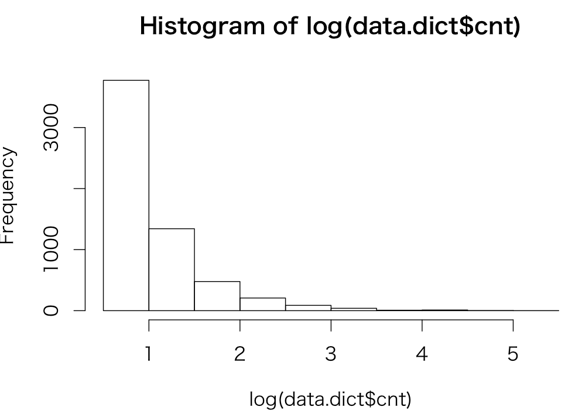
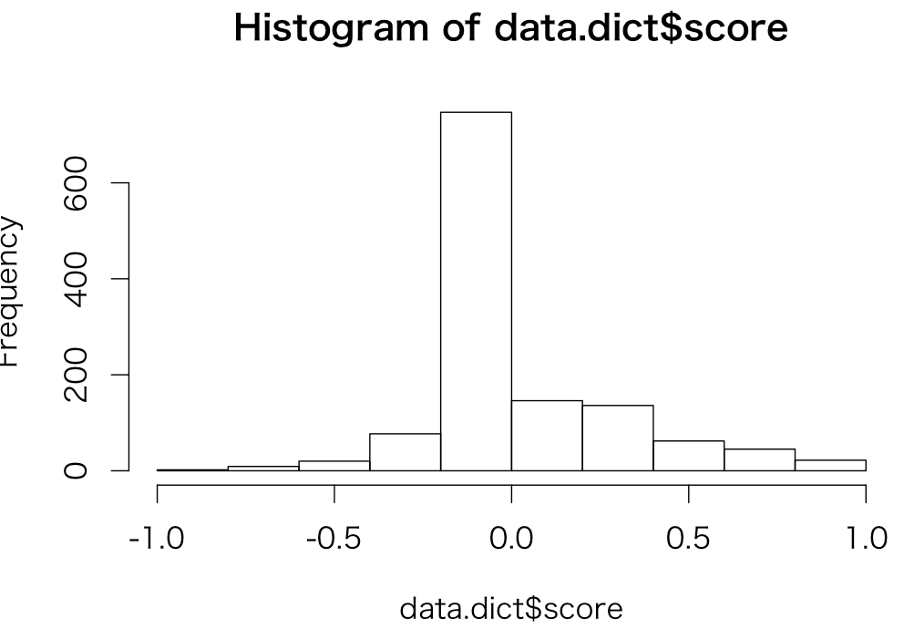

# 極性値辞書検証

Yahooニュースの銘柄コードが特定される記事に対して辞書を作成する。

## 極性値辞書作成方法    
1. 銘柄に紐づく文書を利用（Yahooニュース）。＜＞で囲まれる唯一の銘柄が得られるものを採用
1. 銘柄の株価騰落率(対TOPIX)を取得。＋５％以上で極性値１、−５％以下で極性値−１、その他０
1. 文単位で構文解析し、共起する評価表現を抽出。[景気ウオッチャー](https://github.kabumap.tokyo/utsubo/keiki_watcher/blob/master/md/DICT.md)のロジックと同じ
1. 評価表現に極性値を付与。
1. 極性値辞書内に同一の評価表現があれば履歴から極性値を平均化する
1. 極性値辞書に評価表現と極性値を格納

## 作成
```
$ dict.rb
$ sqlite3 news_dict.db < schema.sqlite3
$ sqlite3 news_dict.db << Eof
.separator "\t"
.import news_dict.txt news_dict
Eof
```

## 検証
#### データの足切り
```
> library(RSQLite)
> con<-dbConnect(dbDriver("SQLite"),"news_dict.db")
> rs<-dbSendQuery(con,"select * from news_dict where cnt>1")
> data.dict<-fetch(rs,-1)
> length(data.dict$cnt)
[1] 5947
> summary(data.dict$cnt)
   Min. 1st Qu.  Median    Mean 3rd Qu.    Max.
  2.000   2.000   2.000   3.441   3.000 183.000
```
cnt>3以上とする



#### スコア分布確認
```
> rs<-dbSendQuery(con,"select * from news_dict where cnt>3")
> data.dict<-fetch(rs,-1)
> length(data.dict$cnt)
[1] 1266
> summary(data.dict$cnt)
   Min. 1st Qu.  Median    Mean 3rd Qu.    Max.
  4.000   4.000   5.000   8.051   8.000 183.000
> hist(log(data.dict$cnt))
>
> ### scoreの分布
> hist(data.dict$score)
> summary(data.dict$score)
    Min.  1st Qu.   Median     Mean  3rd Qu.     Max.
-1.00000  0.00000  0.00000  0.08013  0.16670  1.00000
>
```


#### データ一覧

###### スコア上位(cnt>3)


|score|cnt|word1|word2|word3|word4|word5|word6|word7|word8|word9|
|---:|---:|:---|:---|:---|:---|:---|:---|:---|:---|:---|
|1.0|18|ストップ高|買い気配||||||||
|1.0|6|引け|分割する||||||||
|1.0|6|ストップ高|買い気配|なる|||||||
|1.0|6|買い気配|なる||||||||
|1.0|4|東京証券取引所|指定承認|受ける|||||||
|1.0|4|指定承認|受ける||||||||
|1.0|4|買い|先行する||||||||
|1.0|4|営業日|急反発||||||||
|1.0|4|同値買い気配|なる||||||||
|1.0|4|四半期|決算|転じるた|||||||

###### スコア上位(cnt>20)


|score|cnt|word1|word2|word3|word4|word5|word6|word7|word8|word9|
|---:|---:|:---|:---|:---|:---|:---|:---|:---|:---|:---|
|0.740740740740741|27|営業日|急反発する||||||||
|0.682539682539683|63|年初来高値|更新||||||||
|0.638888888888889|36|売上高|引き上げるた||||||||
|0.573770491803279|61|年初来高値|更新するた||||||||
|0.545454545454546|77|営業利益|だた||||||||
|0.545454545454545|22|前場|付けるた||||||||
|0.542857142857143|35|業績予想|据え置くた||||||||
|0.52|25|業績予想|据え置く||||||||
|0.493150684931507|73|売上高|だた||||||||
|0.481481481481481|27|寄り付き|買う||||||||


###### スコア下位(cnt>3)


|score|cnt|word1|word2|word3|word4|word5|word6|word7|word8|word9|
|---:|---:|:---|:---|:---|:---|:---|:---|:---|:---|:---|
|-1.0|4|ストップ安|売り気配|なる|||||||
|-1.0|4|売り気配|なる||||||||
|-0.769230769230769|13|前場|売るた||||||||
|-0.75|4|下方修正|嫌気するた||||||||
|-0.75|4|見通し|引き下げるた||||||||
|-0.692307692307692|13|売上高|引き下げるた||||||||
|-0.666666666666667|6|損益|圧迫するた||||||||
|-0.666666666666667|6|想定為替レート|ユーロ||||||||
|-0.6|5|赤字|見込む||||||||
|-0.6|5|年初来安値|更新するた||||||||

###### スコア下位(cnt>20)


|score|cnt|word1|word2|word3|word4|word5|word6|word7|word8|word9|
|---:|---:|:---|:---|:---|:---|:---|:---|:---|:---|:---|
-0.227272727272727|22|連結業績予想|下方修正するた||||||||
|-0.181818181818182|33|売上高|下方修正するた||||||||
|-0.133333333333333|30|必要|ある||||||||
|-0.107142857142857|28|*|なる||||||||
|-0.0645161290322581|31|ビジネスワイヤ東芝|発表するた||||||||
|-0.0434782608695652|23|恐れ|ある||||||||
|-0.04|25|特別損失|計上する||||||||
|-0.0363636363636363|55|原文|**||||||||
|-0.0344827586206897|29|金山敏之*|なやむとしゆき*マネックス証券シニアマーケットアナリスト||||||||
|-0.0303030303030303|66|*|編注|記事|ビジネスワイヤ提供||||||
